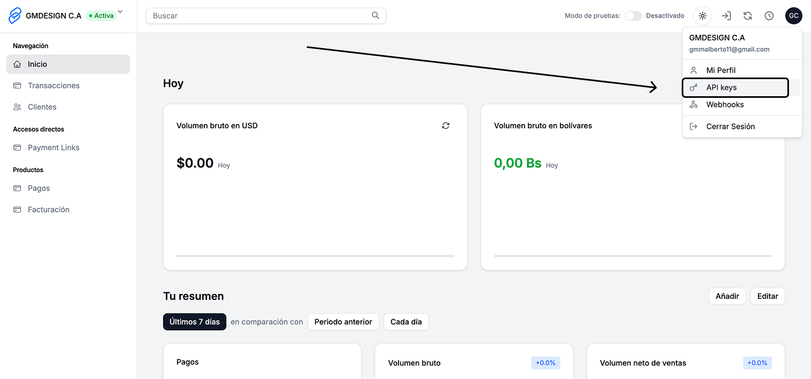

# Primeros Pasos - Intro

Empecemos a integrar el servicio de Venepagos **Cobra en Bolivares de manera automatizada**.

## Crear tu cuenta de Venepagos

Si no tienes cuenta de Venepagos empieza creando una en **[www.venepagos.com.ve/register](https://www.venepagos.com.ve/register)**.

Ten en cuenta que debes tener **RIF JURIDICO** o **RIF PERSONAL** para poder usar el servicio.

Luego activa tu cuenta siguiendo el tutorial de inicio.

### Crea tu primera API Key

Ingresa a la **[pagina de API-KEY de tu dashboard](https://venepagos.com.ve/dashboard/perfil/api-keys)**.

Dale click al boton **"Nueva API Key"** ingresa el nombre de la API luego copia y guardala en un lugar seguro.

En integraciones almacena la API en un archivo de variables de entorno `.env`.
