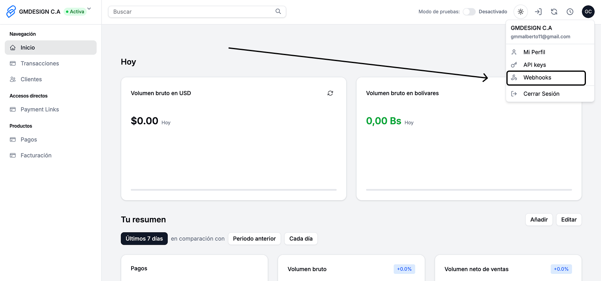

# Crear un WebHook

Sigue estos pasos para registrar un endpoint y recibir notificaciones automáticas de eventos:

1. **Accede a tu cuenta** en el portal de Venepagos y ve a la sección [**Perfil > Webhooks**](https://venepagos.com.ve/dashboard/perfil/webhooks).

2. Completa el formulario:
   - **Nombre del Webhook:** Un nombre descriptivo para identificarlo (ejemplo: "Webhook Producción").
   - **URL del Endpoint:** La URL pública de tu servidor donde recibirás los eventos (ejemplo: `https://miapp.com/webhook`).
   - **Eventos a escuchar:** Selecciona uno o varios eventos que deseas recibir (por ejemplo: `payment.completed`, `payment.failed`, `payment.retry`, `payment.cancelled`, `paymentlink.created`, etc).
   - **Generar secret:** (opcional, recomendado) Marca la casilla para que se genere un secret único que te permitirá validar la autenticidad de los webhooks recibidos.
3. Haz clic en **“Crear Webhook”**.
4. Si generaste un secret, **guárdalo en un lugar seguro**. Solo se mostrará una vez y lo necesitarás para validar la firma de los webhooks.

5. El webhook aparecerá en la lista, donde podrás:
   - Activar/desactivar el webhook.
   - Editar nombre, URL o eventos.
   - Copiar la URL o el secret (si está disponible).
   - Eliminar el webhook si ya no lo necesitas.

> **Notas:**
> - Puedes crear varios webhooks para diferentes entornos o propósitos.
> - Si seleccionas `payment.retry`, recuerda que este evento indica que no debes cerrar el flujo aún; espera `payment.completed` o `payment.failed`.
> - Tu endpoint debe estar disponible públicamente y responder con HTTP 2xx para confirmar la recepción.

